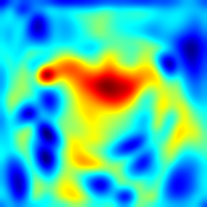

# PatchCore

This repository is one of the PatchCore implementations.



## 🛠Requirements

- python = "^3.10"
- torch = "^2.3.0"
- torchvision = "^0.18.0"
- numpy = "^1.26.4"
- scikit-learn = "^1.5.0"
- opencv-python = "^4.9.0.80"
- scipy = "^1.13.1"
- pillow = "^10.3.0"
- tqdm = "^4.66.4"
- matplotlib = "^3.9.1"
- pyqt6 = "^6.7.1"

## 🌲Directory

<pre>
patchcore
├─── data
│       └── kintsugi   : データセット
│             ├── anomaly  : 異常画像（inference用）
│             └── normal   : 正常画像（train用）
│
├─── environments  : Dockerfileなどの実行環境
│
├─── models        : 学習済みのモデル
│
├─── notebooks     : 実験用のJupyter Notebook
│
├─── outputs       : 出力結果
│
├─── scripts       : スクリプト
│
└─── src           : ソースコード
</pre>

## ⚙️Installation

Clone this repository.

```bash
git clone https://github.com/kargenk/patchcore.git
```

### Using Poetry

Install Poetry:

```bash
# Install the Poetry dependency management tool, skip if installed
# Reference: https://python-poetry.org/docs/#installation
curl -sSL https://install.python-poetry.org | python3 -
```

Create environment with Poetry:

```bash
cd patchcore/src

# Install the project dependencies and Activate
poetry shell
poetry install
```

## 💻Usage

Edit image size, coreset size, threshold, and filepath at `main.py`.
Then, execute following command.

```bash
# make Memorybank (train) and Inference
python main.py
```

<!-- > [!WARNING]
> This is warnings -->

<!-- > [!IMPORTANT]
> This is importants -->

## 📝Note

<!-- > [!NOTE]
> This is notes -->

### Execution Environments

- OS: Ubuntu 22.04.4 LTS
- CPU: AMD Ryzen 7 5700G with Radeon Graphics (8 Core 16 Threads)
- GPU: GeForce RTX 3080 Ti (12GB)
- Memory: 16x2 GB

<!-- OS: lsb_release -a -->
<!-- CPU: lscpu -->
<!-- GPU: lspci | grep -i nvidia -->
<!-- Memory: sudo dmidecode -t memory -->

### Calculation Time⌛

<!-- - processing X takes N \[sec\] to process each image(H x W px). -->
<!--  -->

- Using ResNet50 as Feature Extractor
  - resolution: 256x256
    - It takes N \[hour\] for sampling 1% coreset memorybank. (309 images)
    - It takes N \[sec\] for inference.
  - resolution: 512x512
    - It takes 3 ~ 4 \[hour\] for sampling 1% coreset memorybank. (309 images)
    - It takes 0.3 \[sec\] for inference. (GPU: RTX 3080 Ti, batchsize = 1)
  - resolution: 1024x1024
    - It takes 20/92 \[minutes\] for sampling 10%/50% coreset memorybank. (10 images)
    - It takes 0.75 \[sec\] for inference. (GPU: RTX 3080 Ti, batchsize = 1)

## 🚀Updates

**2024.08.06**

- add split image script

<!-- **2024.08.05**

- add Unfold functions(still bugs)
  - If the size of the input image is large and the anomaly area is small, resizing it smaller may result in loss of features. To address this problem, I added a process that divides the input image into patches in advance. (at dataset.py - Unfold Class and unfold_collate) -->

**2024.07.31**

- support MVTecAD dataset

**2024.07.29**

- add segmentation

**2024.06.03**

- add kNearestNeighbor
- add Random Projection and Greedy Sampling
- add Memory Bank

## 📧Authors

kargenk a.k.a **gengen**(https://twitter.com/gengen_ml)

## ©License

This repository is free, but I would appreciate it if you could inform the author when you use it.

<!-- ProjectTemplate is under [MIT licence](https://en.wikipedia.org/wiki/MIT_License) -->
